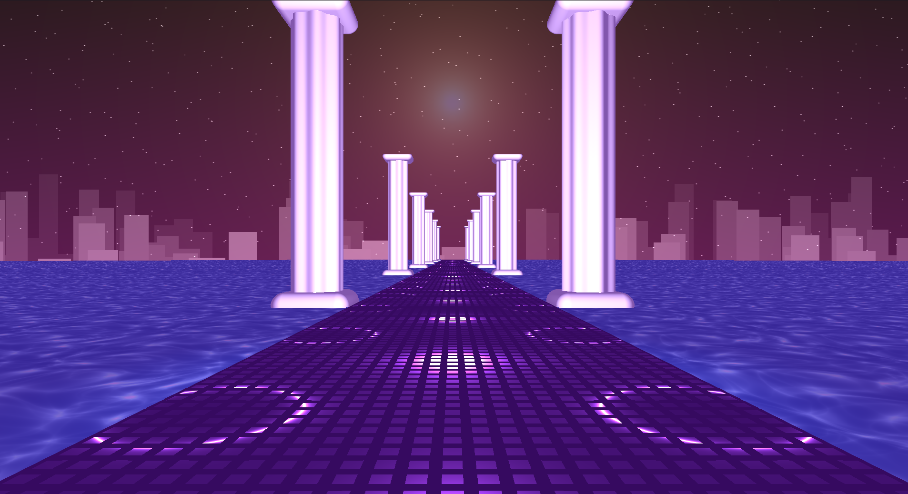

# Raymarching Stuff
Some of the raymarching stuff I have made in my own GLSL compiler environment.

### List of GLSL uniforms used:
  - `u_time` -- float - returns time
	- `u_mouse` -- vec2 - returns mouse position
	- `u_resolution` -- vec2 - returns viewport resolution
	- `u_texture{i}` -- sampler2D - returns sampled texture
  
  
  

## Finn from Adventure Time

## Vaporwave

## Gyroscope

