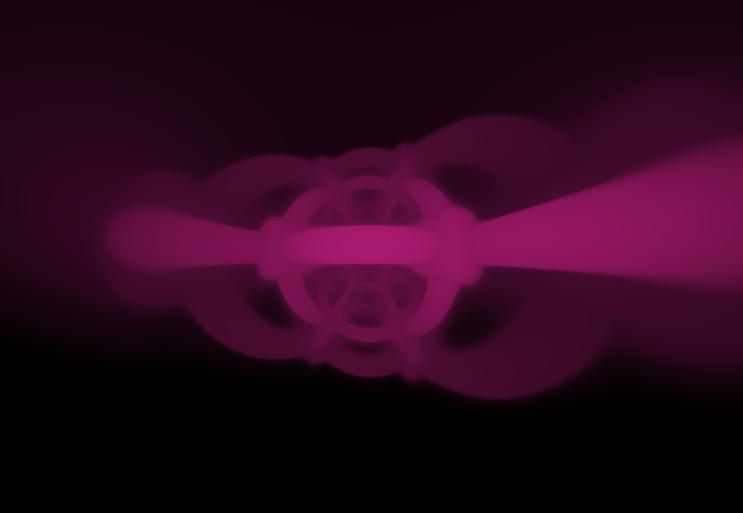

# Raymarching Stuff
Some of the raymarching stuff I have made in my own GLSL compiler environment.

### List of GLSL uniforms:
  - `u_time` -- float - returns time
  - `u_mouse` -- vec2 - returns mouse position
  - `u_resolution` -- vec2 - returns viewport resolution
  - `u_texture{i}` -- sampler2D - returns sampled texture

### List of GLSL golfed uniforms:
  - `T` -- float - returns time 
  - `R` -- vec2 - returns resolution
  - `M` -- vec2 - returns mouse coordinates
  - `L` -- vec2 - returns gl_FragCoord.xy
  - `K` -- vec4 - returns gl_FragColor
	
  
  

## Finn from Adventure Time

## Vaporwave

## Gyroscope

